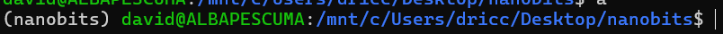

# Guia de uso de Django

1. Crear el entorno virtual en la carpeta del proyecto
    
    ```python
    python -m venv .venv  —prompt <nombre>
    ```
    
2. Una vez creado el entorno virtual hay que activarlo para eso se utiliza el siguiente comando
    
    ```bash
    source .venv/bin/activate
    ```
    



1. Una vez activado hay que descargar Django y crear el proyecto
    
    ```python
    pip install django
    django-admin startproject nanobits .
    ```
    
2. una vez activado hay que realizar las migraciones de la estructura para que se cree la base de datos 
    
    ```python
    ./migrate.py migrate 
     j migrate 
    ```
    
3. Una vez creada la BD hay que crear la app con el siguiente comando de django:
    
    ```python
    django-admin startapp blog
    ```
    
    - Estructura de archivos
        
        
        
4. Ahora hay que crear el modelo esto se hace creando una clase de python en el archivo [models.py](http://models.py) aqui hay un ejemplo de un modelo
    
    ```python
    from django.db import models
    
    # Create your models here.
    
    class Post(models.Model):
        title = models.CharField(max_length=100)
        slug = models.SlugField(max_length=100)
        content = models.TextField()
        created_at = models.DateTimeField(auto_now=True)
    
        def __str__(self) -> str:
            return self.title
    
    ```
    

 7.  Una vez echo eso hay que hacer una migración de la base de datos ya que hemos modificado la estructura de la misma, hay que ejecutar los siguientes comandos

```python
./manage.py makemigrations O j mmigrate
./manage.py migrate O j migrate
```

1. Hay que agregar nuestra app a la lista de apps instaladas del fichero settings.pys
    - Ficheros
        
        
        
        
        

Una vez creada la tabla hay dos maneras de añadir registros a la base de datos una es a través del admin y otra a través de comandos .

## ADMIN

1. Para añadir registros desde el admin habra que agregar un superusuario a los admins y posteriormente enlazar la app
    - Fichero [admin.py](http://admin.py) de blog
        
        
        
        se importa el modelo
        
    
    despues utilizamos el siguiente comando para crear el superuser 
    
    ```python
    ./manage.py createsuperuser
    ```
    
    Ya desde la interfaz de administrador del servido de desarrollo que se ejecuta con
    
    ```python
    ./manage.py runserver o j run
    ```
    
    Abres el enlace y vas a la ruta /admin y entraras a la interfaz de administrador
    

## TERMINAL

Para hacerlo desde la termina hay que en primer lugar abrir una con el comando 

```python
./manage.py shell o j sh 
```

ya dentro de esta abra que importar el/ los modulos que queramos utilizar 

```python
from blog.models import Post
```

Hay dos maneras:

1. Manera rapida
    
    ```python
    from blog.models import Post 
    Post(title='Post1',content='Este es el ejemplo'),save()
    ```
    
2. Manera alternativa
    
    ```python
    from blog.models import Post 
    post1 = Post(title='Post1',content='Este es el ejemplo')
    post1.save()
    ```